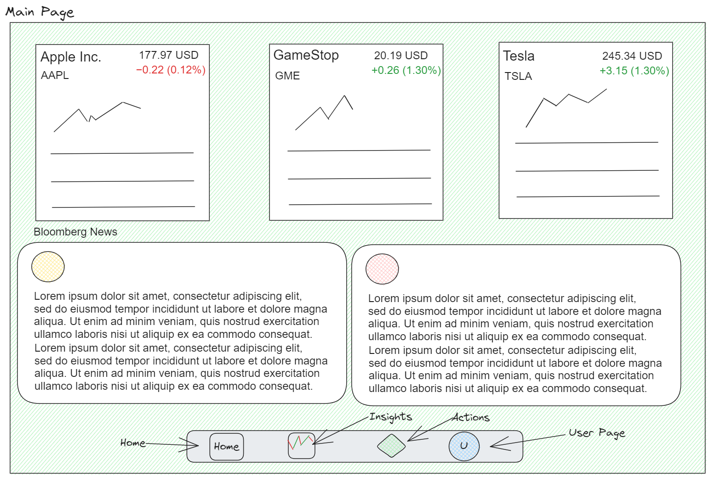

# WhatIfVestments

## USER STORY
    AS A potential investor
    I WANT to see daily stock market data, trends, and candlestick data
    SO THAT I can make educated decisions and research without financial risk

## TABLE OF CONTENTS
- [Deployed Application](#deployed-application)
- [Wireframe](#wireframe)
- [Features](#features)
- [Future Developments](#future-developments)
- [Questions](#questions)

## DEPLOYED APPLICATION
    [Deployed Application URL will go here]

## WIREFRAME

## FEATURES
    - Multiple headline stock market news reports on landing page
    - Top 5 most popular companies to invest in on landing page
    - User nav bar with links to: Favorites, Actions, Trending, User
    - Will be mobile responsive and accessible
    - Allows users the ability to make "what-if" investments and see how that investment may have either increased or decreased over time
    - Users may be able to select a stock to make an alert to show stock health status after a selected amount of time

## FUTURE DEVELOPMENTS
    - Investment/Retirement calculator

## QUESTIONS